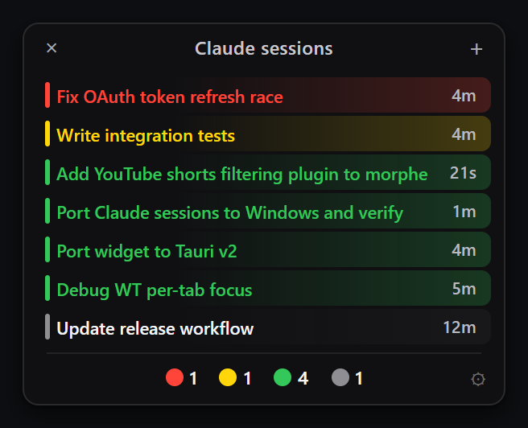
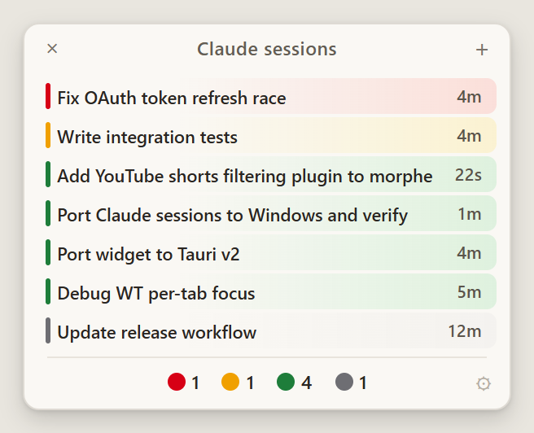
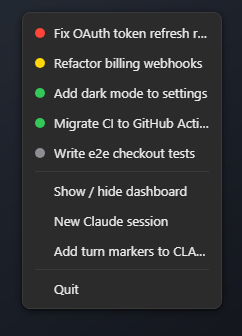
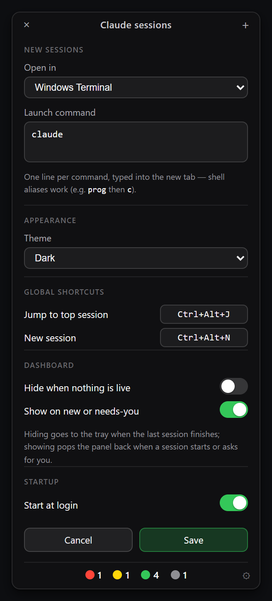

# Claude Sessions

**See every live Claude Code session at a glance, and jump to the one that needs you.**

<p align="center">
  <a href="../../releases/latest"></a>
  <a href="LICENSE"></a>
</p>

A tiny always-on-top dashboard and tray badge, driven by Claude Code lifecycle hooks. Run several sessions across terminals and IDEs without alt-tabbing around to check which one is waiting on you.

<p align="center">
  
  
</p>

Each row is a live session, colour-coded by state:

| | State | Meaning |
|---|---|---|
| 🔴 | **Needs you** | Claude asked something (a permission prompt, a question) |
| 🟡 | **Your turn** | Claude finished and is waiting on your reply |
| 🟢 | **Working** | Claude is busy |
| ⚪ | **Done** | Task complete |

The tray icon (menu bar on macOS) shows the top-priority state, so you know something needs attention even with the dashboard hidden.

## Install

One binary: GUI, hook recorder and installer in one (~6 MB, Rust + [Tauri](https://tauri.app), using the OS webview).

1. Grab `ClaudeSessions-win-x64.zip` or `ClaudeSessions-macos-arm64.zip` from the [latest release](https://github.com/Nicsilver/claude-sessions/releases), or build it yourself:
   ```
   cd session-status/app && cargo build --release
   ```
2. Run it. First launch wires the Claude Code hooks into `~/.claude/settings.json`. Your existing hooks are untouched, and `claude-sessions uninstall` removes only ours.
3. Start a **new** Claude Code session and watch it appear.

To make it permanent, run `claude-sessions install-app` once. It copies the binary to a stable per-user location (`%LOCALAPPDATA%\ClaudeSessions` on Windows, `~/Library/Application Support/ClaudeSessions` on macOS), turns on launch at login, and relaunches from there. `claude-sessions uninstall-app` reverses it. Ticking **Start at login** in the options works too, but then keep the binary where it is: launch-at-login points at its current folder.

Optionally, `claude-sessions markers` (also in the tray menu) adds an instruction block to your global `CLAUDE.md` that makes Claude end each reply with ●, ○, or ◐ (plus rules of thumb for the edge cases), which sharpens the *done* vs *your turn* distinction — ◐ marks a turn that ended only because Claude is waiting on background work (a build, a subagent, a watcher), so the session keeps showing as *working* instead of *your turn*.

The block is versioned: when a newer app changes the marker convention, the widget pops up an offer to swap the old block in your `CLAUDE.md` for the current one (a timestamped backup is saved next to it), and the tray menu shows *Update turn markers* until it's done. Re-running `claude-sessions markers` upgrades in place too — even for a hand-pasted copy without the version comment, as long as the block still ends with its original closing line.

## Using it

| Action | Result |
|---|---|
| Click a session | Jump to its terminal / IDE tab |
| Middle-click | Mute it for an hour (sinks to the bottom) |
| <kbd>Alt</kbd>-click | Rename it inline |
| <kbd>Shift</kbd>-click | Have the AI name it from the transcript (auto-labeling can still evolve it later) |
| `+` / `×` | New Claude session / hide to tray |
| ⚙ | Options |
| Tray left-click | Jump to the top session |
| Tray right-click | Menu, with the live session list |

<p align="center">
  
</p>

## Options

Click the **⚙ gear** to configure:

- **New sessions**: which terminal they open in, and the command typed into the new tab.
- **Appearance**: match the system theme, or force dark / light.
- **Global shortcuts**, rebindable, working from anywhere even with the dashboard hidden. Defaults: <kbd>Ctrl/⌘</kbd> <kbd>Alt</kbd> <kbd>J</kbd> jumps to the top session, <kbd>Ctrl/⌘</kbd> <kbd>Alt</kbd> <kbd>N</kbd> starts a new one.
- **Start at login.**

The dashboard can also get out of your way on its own, with two independent toggles:

| Option | Default | What it does |
|---|---|---|
| **Hide when nothing is live** | off | Drops to the tray when the last session finishes |
| **Show on new or needs-you** | on | Pops the panel back when a session starts, or when one asks for you |

Both only act the moment something changes, so hiding the panel by hand keeps it hidden until the next session appears or needs you.

<p align="center">
  
</p>

## What's in the repo

- **`session-status/app`**: the cross-platform Rust app (widget, tray, hook recorder, installer). All visuals are plain HTML/CSS in `ui/`.
- **`src/`** (repo root, Gradle): the **IntelliJ plugin**, a tool window with the same session list plus focus/close handling for sessions running in JetBrains terminals.

## How it works

Claude Code hooks (`SessionStart`, `UserPromptSubmit`, `PostToolUse`, `Notification`, `Stop`, `SessionEnd`) call `claude-sessions record <state>`, which writes one small JSON file per session under `~/.claude/session-status/state/`. Every surface just reads that directory. No daemon, no IPC; dead sessions are pruned by liveness-checking their PIDs.

## License

[AGPL-3.0](LICENSE)
